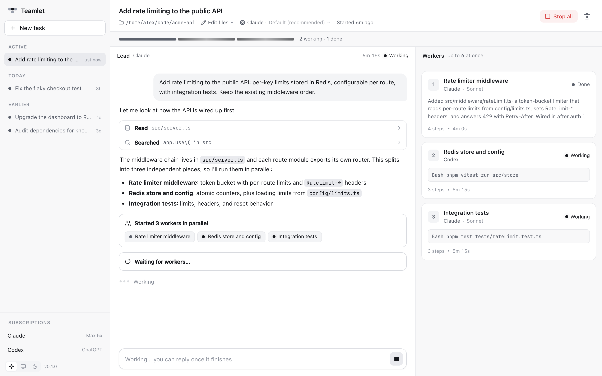

<p align="center"></p>

# Teamlet

[](https://github.com/gs-rumana/teamlet/actions/workflows/ci.yml)
[](https://github.com/gs-rumana/teamlet/releases/latest)
[](LICENSE)

A desktop app for macOS, Windows, and Linux that puts the AI subscriptions you already pay for (Claude Pro/Max, ChatGPT Plus/Pro) to work as a team. You give a task to a **lead agent**. It splits the work, starts **worker agents that run in parallel**, collects their reports, checks how the pieces fit together, and summarizes.

<picture>
  <source media="(prefers-color-scheme: dark)" srcset="docs/screenshot-dark.png">
  
</picture>

The design follows [t3code](https://github.com/pingdotgg/t3code). Teamlet doesn't handle API keys or OAuth tokens itself. It drives the official CLIs that are signed in with your subscription, and a local MCP server gives the lead its delegation tools.

## Get started

### 1. Install a provider CLI

Teamlet drives the official command-line tools, so install at least one and sign in:

- **Claude**: `npm i -g @anthropic-ai/claude-code`, then `claude auth login --claudeai`
- **Codex**: `npm i -g @openai/codex`, then `codex login` ("Sign in with ChatGPT")

You can also sign in from the app: click a provider under **Subscriptions** in the sidebar.

### 2. Install Teamlet

Download the installer for your computer from the [latest release](https://github.com/gs-rumana/teamlet/releases/latest). Each one comes for Apple silicon/ARM (`arm64`) and Intel/AMD (`x64`).

- **macOS**: open `Teamlet-<version>-<arch>.dmg` and drag Teamlet to Applications. If the release notes say the build isn't notarized, run `xattr -dr com.apple.quarantine /Applications/Teamlet.app` once before opening it, or macOS will refuse to open it.
- **Windows**: run `Teamlet-<version>-<arch>-setup.exe`. The installer isn't code-signed yet, so SmartScreen may warn; choose **More info → Run anyway**.
- **Linux**: make `Teamlet-<version>-<arch>.AppImage` executable (`chmod +x`) and run it. It needs FUSE 2 (`libfuse2`, or `libfuse2t64` on Ubuntu 24.04). If it doesn't open on Ubuntu 23.10 or later, start it with `--no-sandbox`.

### Several accounts

Each CLI keeps its sign-in in a config folder. Claude Code uses `~/.claude` (or `CLAUDE_CONFIG_DIR`), and Codex uses `~/.codex` (or `CODEX_HOME`). To use another account, open the provider under **Subscriptions**, click **Add another account**, and choose its folder (for example `~/.claude-work`). For a brand-new account, create an empty folder in the picker and then sign in. A new Codex folder starts without your `config.toml`, so copy it over if you want the same settings. When a provider has more than one account, the new-task form shows an **Account** picker. The lead and its workers on the same provider all run on the account you pick, and follow-up messages stay on it. Teamlet saves the list in `settings.json` in its data folder.

## Using the app

- Teamlet runs a small server inside the app, on `127.0.0.1` only (port 4327 when it's free), so nothing outside your computer can reach it. Quitting stops it; if agents are still working, the app asks first.
- History is kept in `~/.teamlet` (or `TEAMLET_DATA_DIR`).
- On macOS and Linux the app reads `PATH` and the rest of your login shell's environment at startup, so agents find `node`, `git`, and the provider CLIs just as they would in a terminal. On Windows it uses your user environment.
- If something goes wrong, **Help → Show Server Log** opens the server's output. It's in `~/Library/Logs/Teamlet` on macOS, `%APPDATA%\Teamlet\logs` on Windows, and `~/.config/Teamlet/logs` on Linux.

### Access levels

Each session has an access level, which you can change from the session header at any time:

- **Read only**: agents can read and search files, nothing else.
- **Edit files**: agents can change files in the session's folder. Claude asks you before running commands; Codex runs them in its `workspace-write` sandbox.
- **Full access**: no approvals and no sandbox.

A new level applies to every turn that starts afterwards. Claude agents that are working switch immediately; a working Codex agent keeps its level until its turn ends.

## Run from source

Requirements: Node.js ≥ 22.18 and pnpm.

```bash
pnpm install
pnpm desktop                # build the UI and open the desktop app
pnpm dev                    # or work in the browser: UI with hot reload on http://localhost:5173
pnpm build && pnpm start    # or the built UI in the browser, on http://localhost:4317
pnpm desktop:dist           # package an installer for this OS into release/
```

`desktop:dist` builds a `.dmg`, a `-setup.exe`, or an `.AppImage`, depending on the OS it runs on. On macOS it signs with a certificate from your keychain if it finds one, and otherwise signs ad hoc, which is enough to run it on the Mac that built it.

These environment variables change the defaults:

| Variable | Default | |
| --- | --- | --- |
| `TEAMLET_DATA_DIR` | `~/.teamlet` | Session history and settings |
| `TEAMLET_DEFAULT_CWD` | home folder | Default working folder in the UI |
| `TEAMLET_MAX_PARALLEL` | `6` | Max workers running at once; extra workers queue |
| `TEAMLET_PORT` | `4317` | Port for `pnpm start` and `pnpm dev` (the desktop app picks its own) |

## Security model

- The server only listens on `127.0.0.1`, so other computers can't reach it.
- Requests from websites are rejected: the API needs a custom header and an origin of the app itself, and the server only answers requests addressed to `localhost` or `127.0.0.1`, so a page can't reach it through DNS rebinding either.
- Each lead agent gets its own random token for the MCP endpoint, so it can only see and control its own workers.
- The desktop window is sandboxed and can't run Node; it only gets a folder dialog and the theme setting from the app.

## How it works

```
App window ──ws/http──▶ server (Node, 127.0.0.1)
                          ├─ Orchestrator: sessions, agents, worker queue, approvals
                          ├─ Provider adapters
                          │    ├─ Claude → @anthropic-ai/claude-agent-sdk using your `claude` binary
                          │    └─ Codex  → `codex exec --json`
                          └─ MCP server /mcp/<token>  ◀── the lead agent calls these tools
                               list_providers · spawn_workers · wait_for_workers
                               get_worker · message_worker · stop_worker
```

- **Lead**: a normal Claude Code or Codex session with the `teamlet` MCP server attached and extra instructions on how to delegate.
- **Workers**: separate sessions in the same working folder, without delegation tools (one level deep). The lead chooses each worker's provider and model, so a Claude lead can hand a task to Codex.
- **Models** come from each CLI: Claude Code's `supportedModels()` (no prompt is sent, so nothing is used) and `codex app-server`'s `model/list`. The lists reflect your plan and refresh when you click *Refresh*. The lead sees the same list through `list_providers`. The lead's model can be switched from the session header whenever the lead isn't working; its next turn continues the same conversation on the new model.
- **Follow-ups**: you can keep chatting with the lead or message any worker directly from its panel. Conversations resume through the provider's own session ID.

```
shared/protocol.ts          types shared by the server and UI
server/index.ts             HTTP routes, WebSocket, static files, shutdown
server/config.ts            environment configuration
server/orchestrator.ts      sessions, lead/worker lifecycle, parallel queue, approvals
server/mcp.ts               delegation tools (Streamable HTTP, stateless)
server/login.ts             runs provider sign-in and streams it to the UI
server/providers/*.ts       Claude and Codex adapters → normalized events
web/src/                    React UI (light/dark)
desktop/                    Electron app: runs the server in a utility process and opens it in a window
test/                       boots the server and checks its security boundary
```

Adding another provider (Gemini CLI, OpenCode, …) means one new file in `server/providers/` that implements `ProviderAdapter`.

## Notes

- Workers share one folder. The lead is told to give each worker a separate set of files, but nothing enforces that.
- Usage counts against your plan's normal limits. Many workers at once can hit rate limits sooner.
- **Use your own subscription, for yourself.** Don't share Teamlet with other people on your subscription, and don't build a multi-user service on top of it without checking each provider's terms. Anthropic, for example, doesn't allow third-party products to offer claude.ai login without approval.

## Contributing

Contributions are welcome. [CONTRIBUTING.md](CONTRIBUTING.md) covers development setup, checks, and how releases are made, and [CLAUDE.md](CLAUDE.md) explains the architecture. To report a security problem, see [SECURITY.md](SECURITY.md); please don't open a public issue.

## License

[MIT](LICENSE)
